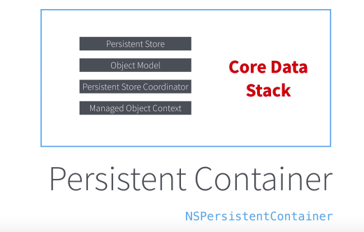

# ToDo
Core Data를 사용한 간단한 Todo 앱

# 기능
- 추가
- 좌,우 스와이프로 완료/삭제
- 중요도 설정
- 셀 클릭하여 수정

# 참고영상
https://www.youtube.com/watch?v=Nl8UkrnbbVc&list=PLgwcD-3WBz9lqyHv9zBfsPiT_FPQTYHwE

# CoreData Configuration 
### CoreData는 기본적으로 4개의 객체로 구성

### Persistent Store :NSPersistentStore - 기본적으로 4 저장소 제공 

### Object Model :NSManagedObjectModel - 모델의 정보를 담당하는 객체

### Persistent Store Coordinator:NSPersistentStoreCoordinator - Persistent Store 에 저장되어 있는 data를 저장하거나 가져오는 객체 

### Managed Object Context :NSManagedObjectContext - 코어데이터를 통해 실행하는 작업을 담당하는 객체
데이터를 생성하면 바로 영구저장소에 저장되는것이 아니라 임시데이터로 유지되며, 저장을 요청해야 저장됨. 아니면사라짐.

영구저장소에서 읽어온 데이터도 컨텍스트에서 처리됨. 이 데이터는 영구저장소에 저장된 데이터 원본의 복사본. 그래서 컨텍스트에있는 데이터를 수정해도 원본은 변하지 않는다. 수정된 내용을 저장하려면 컨텍스트를 저장한다.

# Core Data Stack
대부분의 작업은 context에서 제공하는 api에서 진행되며 , 나머지 세 객체는 초기화 시점을 제외하고는 자주 사용되지 않음.

# Persistent Container :NSPersistentContainer
### core data stack을 캡슐화 한 객체. Appdelegate.swift 파일에 구현하여 싱글톤으로 사용한다.

 AppDelegate.swift 파일 안의 CoreData Stack

# Fetch
### iOS에서 데이터를 읽어 가져오는 것을 Fetch  
NSFetchResultsController

CoreData Stack 처럼 data를 fetch할 때 필요한 객체들의 stack이라고 생각하면 됨.

context의  데이터 요청(request)을 받고 data를 가져오는(fetch) 일련의 과정들을 관리해줌.

# 참고 자료
https://www.youtube.com/watch?v=55MRdTM8RPE&t=887s

https://www.youtube.com/watch?v=ZRwXbb1cOFw

https://www.youtube.com/watch?v=q5CwqHvDI7E&list=PLE0Is7fZwoLA9M6fdCFsfdlG--OK_bF78
